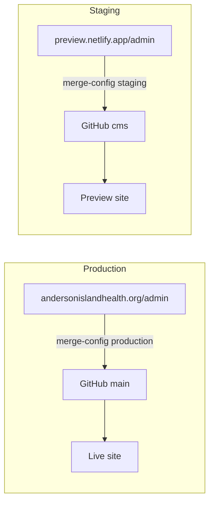

# Content editor (Sveltia CMS)

Board members and staff with GitHub access can update **homepage copy**, **board bios**, **events**, and **fundraising numbers** through a web form—no code editor required.

| Environment | Admin URL | CMS commits to | Public site |
|-------------|-----------|----------------|-------------|
| **Production** | [andersonislandhealth.org/admin/](https://www.andersonislandhealth.org/admin/) | `main` branch | [andersonislandhealth.org](https://www.andersonislandhealth.org/) |
| **Staging** | [incredible-cannoli-8dd540.netlify.app/admin/](https://incredible-cannoli-8dd540.netlify.app/admin/) | `cms` branch | Same Netlify preview URL |

These URLs are not linked from the public site. Bookmark the one you use.

---

## Production vs staging (important)

Sveltia saves content **directly to GitHub**, not to “whichever Netlify URL you opened.” The **`backend.branch`** setting in the CMS config decides where saves go.

| File | Purpose |
|------|---------|
| [`admin/config.production.header.yml`](../admin/config.production.header.yml) | Production backend — `branch: main`, production URLs |
| [`admin/config.staging.header.yml`](../admin/config.staging.header.yml) | Staging backend — `branch: cms`, preview Netlify URL |
| [`admin/collections.yml`](../admin/collections.yml) | **Shared** CMS sections, fields, and hierarchy (edit once) |
| [`admin/merge-config.py`](../admin/merge-config.py) | Builds `config.yml` from header + collections |
| [`admin/config.yml`](../admin/config.yml) | Generated active config loaded by Sveltia at `/admin/` |

**Netlify merges the correct config on deploy** ([`netlify.toml`](../netlify.toml)):

- **Production deploy** (typically `main`) → `python3 admin/merge-config.py production`
- **`cms` branch deploy** → `python3 admin/merge-config.py staging`



### Rules of thumb

- **Test content changes on staging first** — use the preview `/admin/` URL so saves go to the `cms` branch.
- **Production admin** only after CMS is merged to `main` and you intend to go live.
- Opening staging admin while `config.yml` still pointed at `main` will update production (that was the “Test” board member issue). The split above prevents that after redeploy.
- When the preview Netlify URL changes, update `site_url` and `display_url` in `admin/config.staging.header.yml`.
- To promote staging content: merge `cms` → `main` on GitHub (or copy JSON changes manually), then deploy production.

After switching branches or editing `collections.yml`, regenerate config locally:

```bash
python3 admin/merge-config.py staging     # cms branch / preview test
python3 admin/merge-config.py production  # main branch / production test
```

---

## CMS content hierarchy

The admin sidebar mirrors the homepage structure. Each group maps to JSON under [`content/`](../content/) (plus existing data files).

| CMS group | What you edit | JSON file |
|-----------|---------------|-----------|
| **Site settings** | Page title, meta description, floating button labels | `content/site-meta.json` |
| **Hero** | Headline, tagline, CTA buttons | `content/hero.json` |
| **Mission** | Two-column mission copy and donate CTA | `content/mission.json` |
| **Phase 1 plans** | Section intro, pills, timeline **cards** | `content/plans.json` |
| **Donate & giving** | Giving copy, impact bullets, Zeffy sidebar | `content/giving.json` |
| **Donate & giving → Fundraising numbers** | Goal thermometer data | `giving-progress.json` |
| **Board** | Section headings; member list & bios | `content/board-section.json`, `board.json` |
| **FAQs** | Section intro and FAQ **cards** | `content/faqs.json` |
| **Events** | Section intro; individual events | `content/events-section.json`, `events.json` |
| **Contact, footer & legal** | Contact cards, footer, volunteer modal, tax disclosure | `content/contact.json`, `content/footer.json`, `content/volunteer-modal.json`, `content/charity-disclosure.json` |

### Rich text hints

Several fields support lightweight formatting in the CMS:

- **Bold:** wrap text in `**double asterisks**`
- **Links:** `[link label](https://example.com)` or `[email us](mailto:info@andersonislandhealth.org)`
- **Paragraph breaks:** blank line between blocks

The site renders these safely on load via [`content.js`](../content.js).

### Not in the CMS (developer-only)

- Page layout, colors, fonts (`index.html`, `style.css`)
- Navigation links (`partials/navbar.html`)
- JSON-LD structured data (inline in `index.html`)
- Logo and photo **files** in `assets/` (paths in CMS point to existing files)

---

## Who can access it

You must be a **GitHub collaborator** on the `andersonislandhealth/AI-Health` repository with **Write** access (or higher). Sign in with your **GitHub account** when prompted.

Sveltia CMS does not use Netlify Identity or email/password login. If someone is not invited as a collaborator, they cannot save changes.

To add an editor, an org admin should:

1. Open the repo on GitHub → **Settings** → **Collaborators** (or **Manage access**).
2. **Invite** the person by GitHub username or email.
3. Grant **Write** role.
4. Share this doc and the admin URL above.

If a board member does not have GitHub, they can create a free account at [github.com](https://github.com) and accept the invite.

---

## One-time setup (org admin / developer)

These steps are done once per site, not by every editor.

### 1. Confirm repository

- Repo: **`andersonislandhealth/AI-Health`** on GitHub.
- Netlify must deploy from this org repo (not an old fork).
- CMS config lives in [`admin/config.production.yml`](../admin/config.production.yml) and [`admin/config.staging.yml`](../admin/config.staging.yml) — see [Production vs staging](#production-vs-staging-important) below.

### 2. GitHub OAuth app

1. GitHub org → **Settings** → **Developer settings** → **OAuth Apps** → **New OAuth App**.
2. **Authorization callback URL:** `https://api.netlify.com/auth/done`
3. Register and copy the **Client ID** and **Client Secret**.

See [Sveltia GitHub backend — Using Netlify](https://sveltiacms.app/en/docs/backends/github).

### 3. Netlify OAuth provider

1. Netlify site dashboard → **Project configuration** → **Access & security** → **OAuth**.
2. **Install provider** → **GitHub**.
3. Paste the Client ID and Client Secret from step 2.
4. Save.

Use **Access & security**, not **Identity** (Identity / Git Gateway is deprecated and not supported by Sveltia).

### 4. Deploy

Push commits that include the `admin/` folder and `netlify.toml`. After deploy, open `/admin/` and sign in with a collaborator account to confirm login works.

---

## What you can edit

Most visible homepage copy is CMS-managed. The table below highlights major sections; see [CMS content hierarchy](#cms-content-hierarchy) for the full list.

| CMS section | File(s) updated | Appears on site |
|-------------|-----------------|-----------------|
| **Hero, Mission, Plans, Giving, FAQs, Contact, Footer** | `content/*.json` | Matching homepage sections |
| **Board Members** | `board.json` + `content/board-section.json` | [Board section](https://www.andersonislandhealth.org/#board) |
| **Events** | `events.json` + `content/events-section.json` | [Events section](https://www.andersonislandhealth.org/#events) |
| **Fundraising Progress** | `giving-progress.json` | Donate section thermometers / goal labels |

### Board members

- **Name** and **Role** always show on the board grid.
- **Biography:** leave empty until ready. Members **without** a bio do not get the expand arrow on the website.
- **Photo path:** optional; photos are not displayed on the site yet.

Members are sorted **alphabetically by name** on the live site.

### Events

- **Date** is required (`YYYY-MM-DD`). The site automatically puts today/future events under **Upcoming** and older dates under **Past events**.
- **Display date** is optional (e.g. `April 29, 2026`).

### Fundraising

- Updates **goal** and **current** amounts shown in the site thermometers.
- Zeffy’s embedded form may show its own live totals; keep this file in sync when you update public numbers manually.

---

## Saving changes

### Production

1. Open [https://www.andersonislandhealth.org/admin/](https://www.andersonislandhealth.org/admin/).
2. Sign in with **GitHub**.
3. Choose **Site Content** → Board Members, Events, or Fundraising Progress.
4. Edit fields and click **Save** (or **Publish**).
5. Sveltia commits to the **`main`** branch on GitHub.
6. Netlify rebuilds production (usually **1–2 minutes**).
7. Hard refresh the homepage (`Cmd+Shift+R` / `Ctrl+Shift+R`).

### Staging (safe testing)

1. Open [https://incredible-cannoli-8dd540.netlify.app/admin/](https://incredible-cannoli-8dd540.netlify.app/admin/).
2. Sign in with **GitHub** (same OAuth setup).
3. Edit and save — commits go to the **`cms`** branch only.
4. Hard refresh the **preview** site URL to verify (not andersonislandhealth.org).
5. Merge `cms` → `main` when ready for production.

---

## Important rules

- **One editor at a time.** If two people edit the same file at once, the last save wins. Coordinate by email or chat.
- **Do not edit the same JSON files in GitHub’s web editor** while someone is using the CMS—pick one workflow.
- **Layout, design, FAQs, and mission copy** are still in `index.html` and require a developer to change.
- **Donations (Zeffy)** and the **volunteer form (Google)** are not managed in the CMS.

To undo a mistake, an admin can revert a commit on GitHub or restore an earlier version from **History** in the CMS.

---

## Local testing (developers)

The CMS needs HTTP and GitHub auth. For local work:

1. Run a static server from the repo root: `python3 -m http.server 8080`
2. Open `http://127.0.0.1:8080/admin/`
3. Sign in with GitHub (OAuth still goes through Netlify’s proxy when configured for the production site)

For offline config testing without saving to GitHub, see [Sveltia local development](https://sveltiacms.app/en/docs/start) and optional `local_backend` in the docs.

---

## Files reference

| Path | Purpose |
|------|---------|
| `admin/index.html` | CMS shell (loads Sveltia from CDN) |
| `admin/collections.yml` | Shared field definitions (all sections) |
| `admin/config.production.header.yml` | Production GitHub branch + URLs |
| `admin/config.staging.header.yml` | Staging GitHub branch + URLs |
| `admin/merge-config.py` | Builds `admin/config.yml` |
| `admin/config.yml` | Generated — active CMS config at runtime |
| `content.js` | Loads `content/*.json` and renders homepage copy |
| `content/*.json` | Homepage section copy (CMS-managed) |
| `board.json` | Board roster and bios |
| `events.json` | Event list |
| `giving-progress.json` | Fundraising goal numbers |

Optional: `board.csv` can still be used offline to collect bios before pasting into the CMS—it is not the live source of truth.

---

## Troubleshooting

| Problem | What to try |
|---------|-------------|
| Login fails | Confirm Netlify OAuth provider is installed with correct GitHub OAuth app credentials |
| Save fails / permission denied | Confirm your GitHub user is a repo collaborator with Write access |
| Changes not on site | Wait for Netlify deploy to finish; hard refresh the homepage |
| Changes on wrong site | Check which `/admin/` URL you used; verify `backend.branch` in deployed `/admin/config.yml` |
| Staging save hit production | Redeploy `cms` branch; confirm `config.staging.header.yml` has `branch: cms` and Netlify build ran `merge-config.py staging` |
| Page shows “Loading…” | Check `content/*.json` deployed; open browser console for fetch errors |

For CMS product questions, see [Sveltia CMS documentation](https://sveltiacms.app/en/docs).
